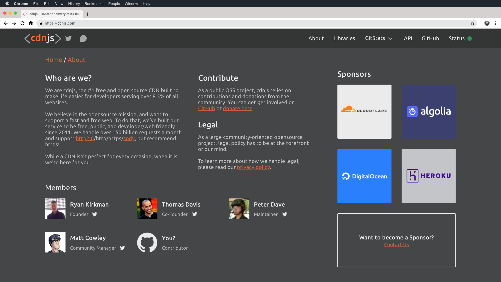

<h1 align="center">
    <a href="https://cdnjs.com">"></a>
</h1>
 
<h3 align="center">The #1 free and open source CDN built to make life easier for developers.</h3>

---

[Back to parent directory](..)

## About

| Preview | Hovering on Sponsor Card |
|---------|--------------------------|
|  |  |

### Who are we

This is the most important part of this page.
This describes the orgs goals, hook content to engage people, and provides needed/wanted technical information.
cdnjs needs more focused, aimed, and consistent brand text that is modern, actionable, and states the purpose of the
 org... this area serves to do that.

### Contribute

Describes our openness to contributions, providing links to proper documentation\* for code and a single source (that
 the org needs to decide on) to be point for donations.

\* We need to begin work on [the new documentation](https://github.com/cdnjs/new-docs) to create a better contributor
flow, make it more beginner friendly, and still get the needed information across professionally. 

### Legal

Describes the legal policy for cdnjs, linking to the proper documentation\*\*.

\*\* We still need to follow up with Cloudflare on forming a proper set of policies in-line with the services that they
 provide for the cdn.

### Members

Active org members, organized by seniority. Usernames link to their GitHub profiles, Twitter icons are included for
 members with them.

### Sponsors

cdnjs has a few sponsors, all of which deserve a notice. This section features half cards, and full cards. The full card
 is utilized only for when there are an even number of sponsors, and we want to show a full-space "Want to become a
 sponsor?"

On hover, each sponsor card shows the sponsors wanted description. 