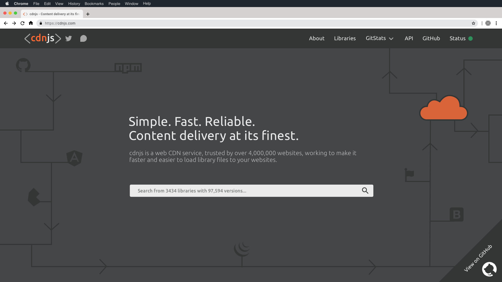
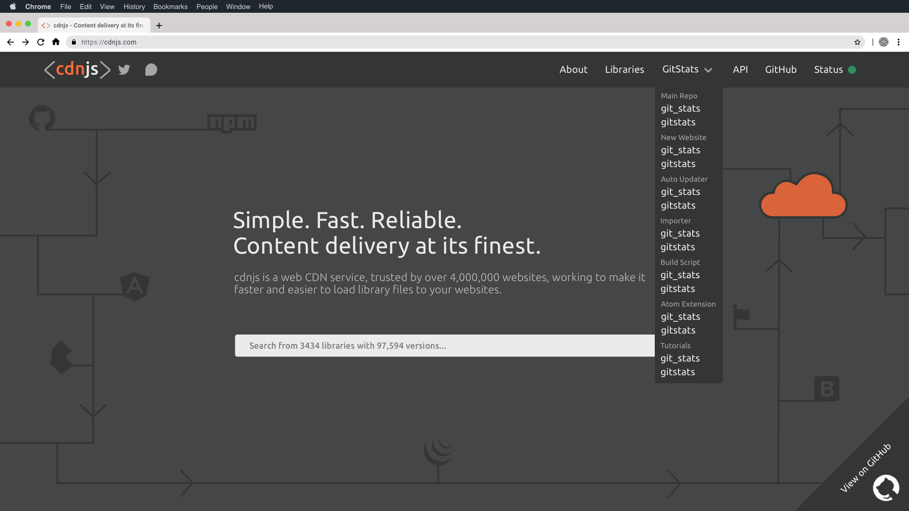
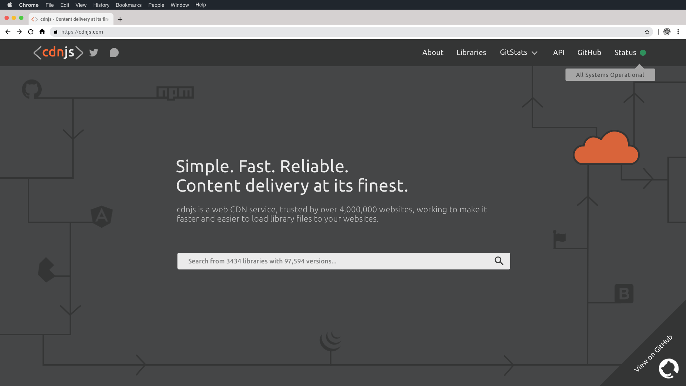

<h1 align="center">
    <a href="https://cdnjs.com">"></a>
</h1>
 
<h3 align="center">The #1 free and open source CDN built to make life easier for developers.</h3>

---

[Back to parent directory](..)

## Landing

| Preview | GitStats Dropdown | Hovering on Status |
|---------|-------------------|--------------------|
|  |  |  |

### Search

Tagline, search text, no search icon. Modern, actionable, prominent.

### GitHub Banner

Custom, but not deviating from the new cdnjs (or GitHub) brand guidelines. Redirects to the main GitHub repository.

### Illustration

This is meant to be a subtle accent to erase whitespace, while subliminally defining what a cdn is and how it interacts
 with the world. 

This simple illustration comes with one fancy card up its sleeve; The Orange Cloud. This cloud represents our dependance
 and relationship with Cloudflare, to continue that to it's proper end this cloud redirects to Cloudflare on click.