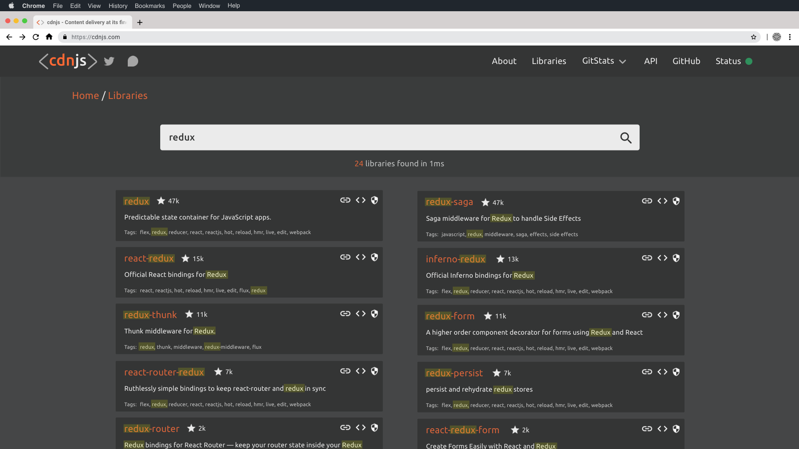

<h1 align="center">
    <a href="https://cdnjs.com">"></a>
</h1>
 
<h3 align="center">The #1 free and open source CDN built to make life easier for developers.</h3>

---

[Back to parent directory](..)

## Libraries

| Preview | Searching for `redux` |
|---------|-----------------------|
|  |  |

### Search

The search here is the same as on the landing, but not oriented around an action as much as an experience.
The current search is not consistent and not friendly.
It's buggy, has two UI types, and the experience is not tailored to make transitions easy. 

This search has a consistent UI on cards and should have significant less bugs. 

### Cards

These cards are not meant to be pretty as much as functional.
These cards are also work in progress, and I plan to make some minor changes to them as they are converted into code. 

These cards were meant to simplify the previous UI, while providing all of the required information.
The current issue with these cards revolves around the copying UI, which I put temporary icon placeholders.
I am still deciding on the actual method for the copy UI, and will update these accordingly. 