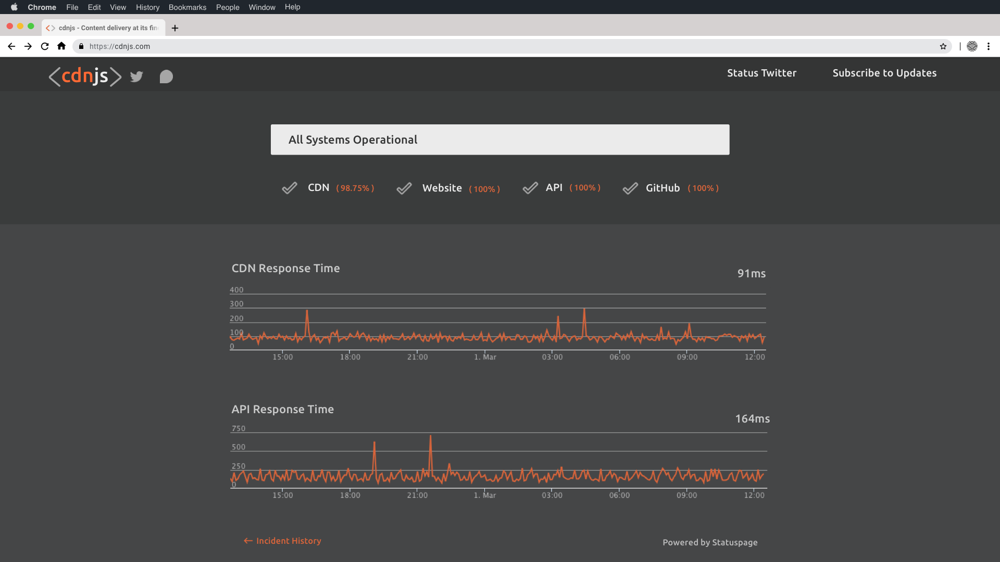
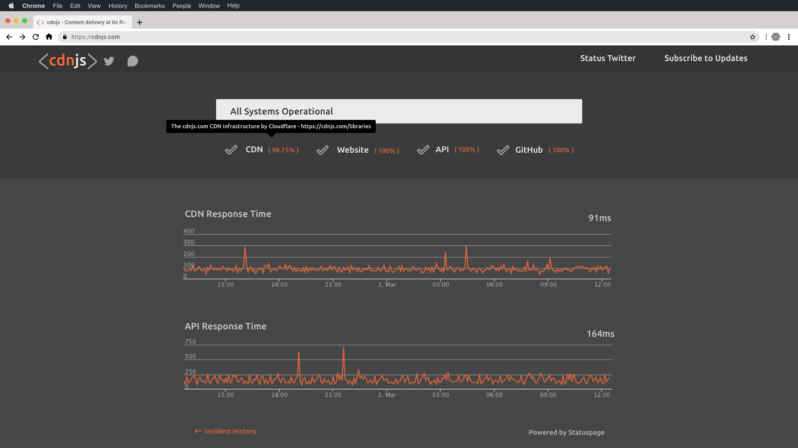

<h1 align="center">
    <a href="https://cdnjs.com">"></a>
</h1>
 
<h3 align="center">The #1 free and open source CDN built to make life easier for developers.</h3>

---

[Back to parent directory](..)

## Status

| Preview | Hovering on Component |
|---------|-----------------------|
|  |  |

### Message Block

This is the most important element of the status page.
This quickly describes to the user, in a single line, the status of the service we are providing.
It is essential that this is made large and easy to identify for any user visiting the page.

### Components

These provide information about each of the major components that we provide as a service to our users.
Each one has an icon that represents its status as well as a percentage for its uptime in the last 30 days.

On hovering over each component, a tooltip will show with a more detailed description of what each component is.

### Graphs

Being able to view historical data about the response times of the services we provide gives users insight into
 potential issues relating to resources loading and also provides assurance that we are providing a fast cdn.